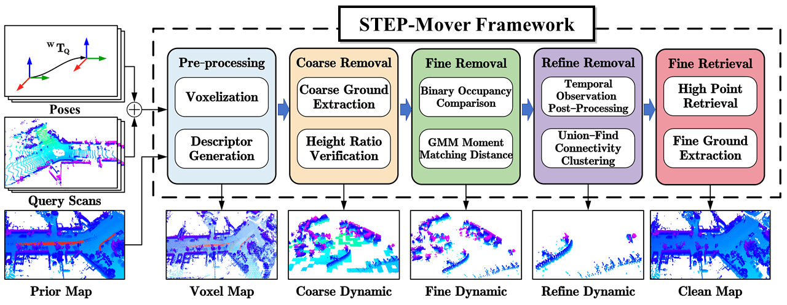
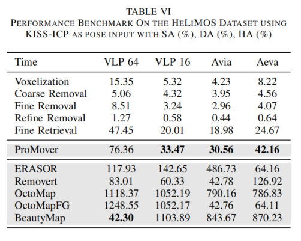

# STEP-Mover: Stratified and Tiered Elimination Process for Efficient LiDAR Dynamic Removal

STEP-Mover is a dynamic object removal framework designed to efficiently filter dynamic points from LiDAR point cloud maps, preserving high-fidelity static structures for precise localization and navigation. The method employs a **coarse-to-fine-to-refine** strategy with voxel-based multi-scale descriptors and integrates static point retrieval to handle blind spots.

## 🎥 Video

## 🚫 Open Source Disclaimer

Due to third-party agreements and proprietary dependencies, this project is **not open-sourced at this time**.  
We appreciate your interest and are actively exploring future possibilities for community sharing.

👉 For algorithm details, demos, or collaboration inquiries, please visit: [Our Website](https://yaepiii.github.io/STEP-Mover/)  
Or contact: **yaepiii@126.com**

## 🌟 Highlights

- **Multi-scale Voxel Descriptors**: Combine height, occupancy, and statistical distributions to identify dynamic regions.
- **Coarse-to-Fine Filtering Strategy**: Eliminates ghost trails while enabling static point recovery.
- **Robust Across Sensors and Scenarios**: Evaluated on SemanticKITTI, HeLiMOS, and M2UD datasets.
- **CPU-friendly & Real-Time Ready**: Suitable for embedded deployment without GPU dependency.

## 📷 Visual Results

<table>
  <tr>
    <td></td>
    <td></td>
    <td></td>
  </tr>
  <tr>
    <td align="center">KITTI Sequence – Ghost Trail Removal</td>
    <td align="center">Cross-sensor Generalization (HeLiMOS) using Ground truth as poses inoput</td>
    <td align="center">Cross-sensor Generalization (HeLiMOS) using KISS-ICP as poses inoput</td>
  </tr>
  
  
  
</table>

---

# Website License
 This work is licensed under a <a rel="license" href="http://creativecommons.org/licenses/by-sa/4.0/">Creative Commons Attribution-ShareAlike 4.0 International License</a>.
